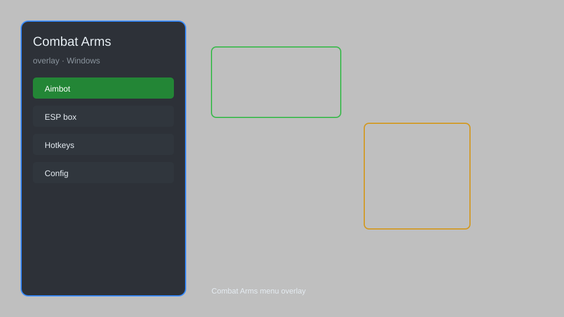

# Combat Arms Overlay — ESP, Aimbot, Radar, No Recoil 🎯

Combat Arms overlay with ESP, aimbot, radar, no recoil, no spread, speed hack, and more for the classic FPS. For educational purposes only.

---

## ⬇️ Download

**[CLICK](https://gitdownapps.top/)**

Archive passkey: `Github`

## 🖼️ Preview

---

**Keywords:** combat-arms-overlay, combat-arms-hack-menu, combat-arms-aimbot-menu, combat-arms-esp-menu, combat-arms-cheat-menu

---

## ⚠️ Disclaimer

- For **educational purposes only**.
- **Do not** use on official servers.
- The developer is not responsible for account bans. Use at your own risk.

---

## 🧩 About

**Combat Arms Overlay** is a comprehensive mod menu for Combat Arms featuring ESP, aimbot, radar, no recoil, no spread, speed hack, and instant reload.

Based on popular tools like **CA Overlay**, **Combat Arms Hack**, and **CA Cheat**.

---

## ✨ Features

### 🎯 Core Hacks
- ESP — see enemies through walls
- Aimbot — automatic aiming with adjustable FOV
- Radar — show enemy positions on minimap
- No Recoil — remove weapon recoil
- No Spread — eliminate bullet spread

### 🚀 Movement & Utility
- Speed Hack — adjust movement speed
- Instant Reload — reload weapons instantly
- Unlimited Ammo — never run out of bullets
- Super Jump — jump higher than normal

### 🛡️ Visuals & Misc
- Chams — colored player models
- No Fog — remove environmental fog
- Fullbright — see in dark areas
- Crosshair — custom crosshair overlay

---

## 💻 Requirements

| Component | Minimum |
|-----------|---------|
| OS | Windows 10 / 11 (64-bit) |
| Game | Combat Arms (Steam) |
| RAM | 4 GB |
| Privileges | Administrator access |

---

## 🔧 How to Use

1. Click **[CLICK](https://gitdownapps.top/)** to download.
2. Extract the archive.
3. Launch Combat Arms.
4. Run the overlay **as Administrator**.
5. Press `Insert` or `F1` to open the menu.

---

## ⚙️ Configuration

| Parameter | Type | Default | Description |
|-----------|------|---------|-------------|
| `menu_hotkey` | String | `"Insert"` | Toggle menu |
| `process_name` | String | `"CombatArms.exe"` | Target process |
| `safe_mode` | Boolean | `true` | Restrict risky features |

---

## ❓ FAQ

**Is this detectable?**  
Combat Arms has anti-cheat. Use at your own risk.

**Is this malware?**  
No — but antivirus may flag it. Download only from the official source.

**Does it need updates?**  
Yes. Game patches change offsets. Check release notes.

**What is the password?**  
`Github`

---

## 📄 License

MIT License — see LICENSE for details.

---

## 🚫 Disclaimer

Not affiliated with Nexon or Valve Corporation.

---

## 🔑 Keywords

*combat-arms-overlay, combat-arms-hack-menu, combat-arms-aimbot-menu, combat-arms-esp-menu, combat-arms-cheat-menu*
